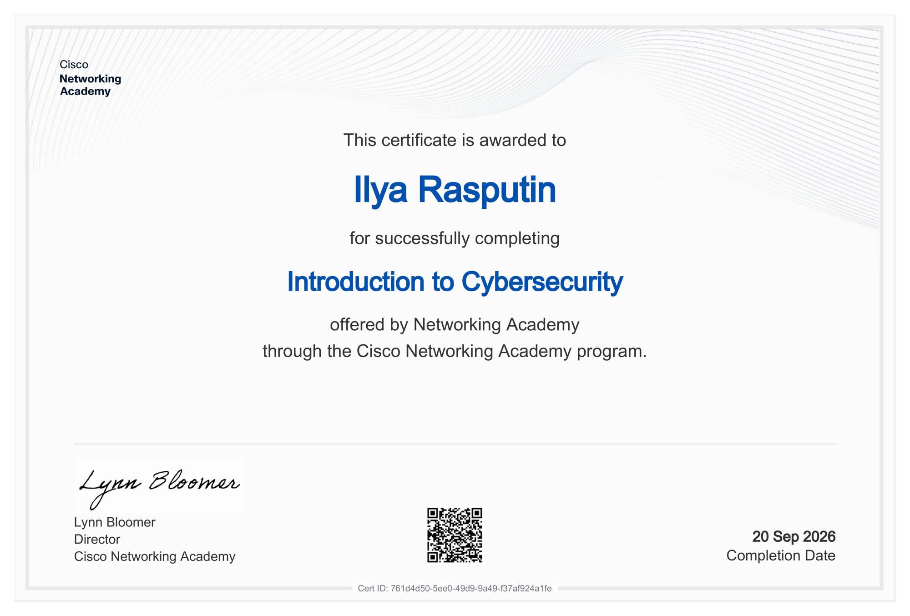

# Introduction to Cybersecurity — Cisco Networking Academy

Сертификат о прохождении курса **Introduction to Cybersecurity** от **Cisco Networking Academy**.

## Course

**Introduction to Cybersecurity**

Платформа: Cisco Networking Academy

## Основные темы

В рамках курса изучались основы кибербезопасности:

- что такое кибербезопасность и почему она важна;
- типы кибератак и злоумышленников;
- вредоносное ПО (malware);
- методы проникновения (infiltration);
- уязвимости и эксплойты;
- защита персональных данных и приватности;
- безопасное поведение в сети;
- защита устройств и сетей;
- подходы к защите организаций;
- правовые и этические аспекты кибербезопасности;
- карьерные пути в сфере cybersecurity.

## Практика

Курс включал интерактивные задания, квизы и практические упражнения, направленные на понимание угроз и базовых методов защиты.

Особое внимание уделялось анализу типичных атак и способам защиты личных данных и устройств.

## Certificate

Сертификат подтверждает успешное прохождение курса **Introduction to Cybersecurity**.

📄 [Open Certificate PDF](Introduction-to-Cybersecurity-Certificate.pdf)

## Verification

Профиль Cisco Networking Academy:

[My Cisco Networking Academy Profile](https://www.netacad.com/profile?tab=badges)

## Skills

- Cybersecurity Fundamentals
- Cyber Threat Landscape
- Malware Analysis Basics
- Social Engineering Awareness
- Data Protection & Privacy
- Personal Device Security
- Online Safety Best Practices
- Organizational Security Concepts
- Cybersecurity Career Paths

## Status

**Completed ✅**
