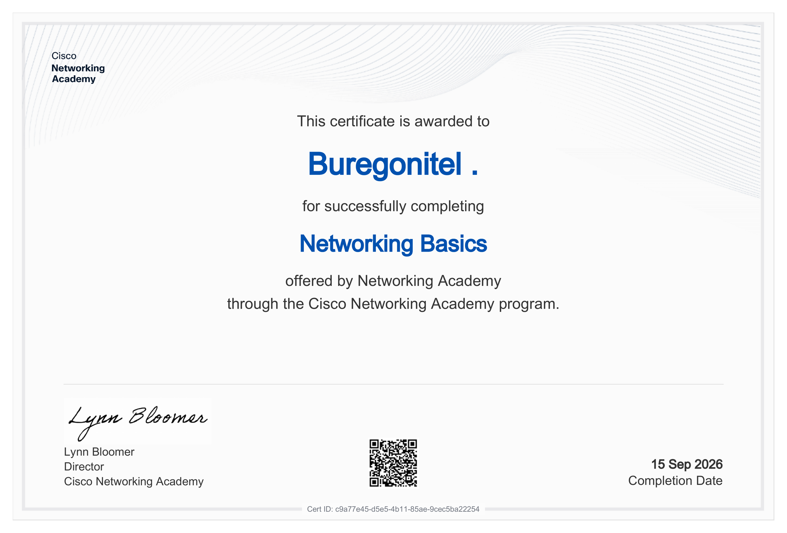

#  Networking Basics — Cisco Networking Academy

Сертификат о прохождении курса **Networking Basics** от **Cisco Networking Academy**.

## Course

**Networking Basics**

Платформа: Cisco Networking Academy

## Основные темы

В рамках курса изучались основы компьютерных сетей:

- сетевые устройства;
- сетевые среды передачи данных;
- сетевые протоколы;
- IP-адресация;
- Ethernet;
- основы работы LAN;
- базовая настройка сетевых устройств;
- беспроводные сети;
- сетевые сервисы;
- базовая диагностика сетевого соединения.

##  Практика

Курс включал практические лабораторные работы и задания, связанные с настройкой и проверкой сетевых подключений.

В рамках обучения выполнялись практические работы в **Cisco Packet Tracer**, включая настройку сетевых устройств и проверку соединения.

[cisco-packet-tracer-labs](https://github.com/Buregonitel/cisco-packet-tracer-labs)

##  Certificate

Сертификат подтверждает успешное прохождение курса **Networking Basics**.

📄 [Open Certificate PDF](https://github.com/Buregonitel/cybersecurity-learning-portfolio/blob/main/certifications/Cisco-Certificate/Networking/Networking-Basics-Certificate.pdf.)

##  Verification

Профиль Cisco Networking Academy:

[My Cisco Networking Academy Profile](https://www.netacad.com/profile?tab=badges)

##  Skills

- Networking Fundamentals
- IPv4
- Ethernet
- LAN
- Network Devices
- Network Protocols
- Wireless Networking
- Basic Network Troubleshooting
- Cisco Packet Tracer

##  Status

**Completed ✅**
