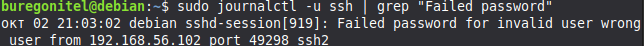
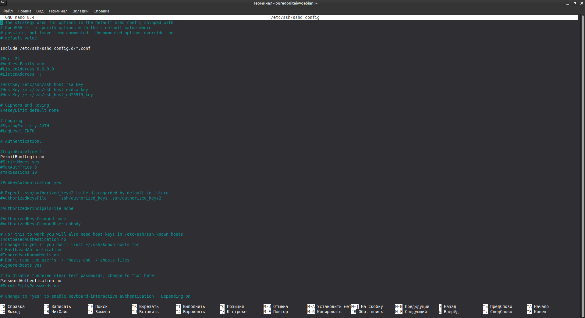

# 🛡️ Cybersecurity Home Lab: Project #1 - SSH Hardening & Log Analysis

> **Goal:** Deploy a hardened SSH service, restrict access to Ed25519 public key authentication, and analyze authentication logs for unauthorized access detection.

---

## 📐 Environment & Network Topology

The lab setup is isolated using a Host-Only virtual network to allow safe attack simulations and log analysis directly from the host terminal.

```text
+-------------------------------------------------------------------+
|                        Linux Mint (Host OS)                       |
|                          IP: 192.168.56.1                         |
+-------------------------------------------------------------------+
                                  |
            +---------------------+---------------------+
            | Host-Only Network (192.168.56.0/24)       |
            v                                           v
+-----------------------+                   +-----------------------+
|   Debian (Attacker)   |                   |    Debian (Target)    |
|   IP: 192.168.56.102  |  --- SSH Attack ->|   IP: 192.168.56.101  |
|   Role: Client/Attack |                   |   Role: Server/Victim |
+-----------------------+                   +-----------------------+
```

---

## 🚀 Execution Steps

### Step 1: Simulating an Attack & Log Inspection
To observe how authentication events are recorded by the system, an unauthorized login attempt was generated from the Attacker VM (`192.168.56.102`) targeting an invalid user account (`wrong_user`).

On the Target server, system logs were queried using `journalctl` to filter SSH daemon events:

```bash
sudo journalctl -u ssh | grep "Failed password"
```

#### 🔍 Detected Event:


> **Log Analysis:** The log line shows that `sshd-session` flagged a failed password attempt for `wrong_user` originating from IP `192.168.56.102` on port `49298`.

---

### Step 2: SSH Key Pair Generation & Deployment
To eliminate password brute-force vectors, an asymmetric Ed25519 key pair was generated on the Attacker VM and deployed to the Target server:

```bash
# Generate Ed25519 key pair on Attacker
ssh-keygen -t ed25519

# Deploy the public key to Target
ssh-copy-id buregonitel@192.168.56.101
```

---

### Step 3: Enforcing SSH Hardening
To secure the SSH daemon against credential stuffing and brute-force attacks, the primary configuration file `/etc/ssh/sshd_config` was modified on the Target server:

```bash
sudo nano /etc/ssh/sshd_config
```

#### Key Directives Configured:
* `PermitRootLogin no` — Disables direct SSH authentication for root.
* `PasswordAuthentication no` — Completely disables password-based authentication.
* `PubkeyAuthentication yes` — Restricts authentication strictly to public SSH keys.

#### 📄 Config View (`/etc/ssh/sshd_config`):


To apply the changes, the SSH service was restarted:
```bash
sudo systemctl restart ssh
```

---

### Step 4: Defense Verification
To verify that password authentication is completely disabled, an unauthorized SSH connection was attempted from the Attacker VM:

```bash
ssh wrong_user@192.168.56.101
```

#### 🚫 Server Response:
.png)

> **Result:** The server immediately dropped the connection with `Permission denied (publickey)` without prompting for a password. Password-based brute-force attacks are now ineffective against this server.

---

## 🛠️ Key Takeaways

* **SIEM & Log Auditing:** Gained hands-on experience locating and parsing SSH security events using `journalctl`.
* **Linux Server Hardening:** Applied security best practices by disabling password authentication and root SSH access.
* **Cryptographic Authentication:** Implemented public key authentication via the Ed25519 algorithm.
